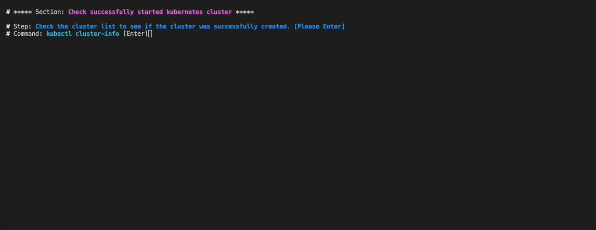

# Tekton Local Playground

To understand Tekton, it can be cumbersome to build a local environment and install and delete it every time.
for this reason, This project is a simple script configured to quickly configure and test Teckton CI/CD in the local environment.

You can run pre-written scripts through the `make` command, and STEP is given for each script to help you understand the Tekton project.

)

## pre-installed

This project works based on `minikube`. 
`minikube` must be installed in the local environment in advance.

## Get Started

You need to clone this project first.
Then move to the cloned project and run the `make` command to run the scripts.

### 1) OnBoard Tutorial - install tekton pipeline and execture `TaskRun`

```
$ make onboard
```

The first thing to do is run the onboard script. 

onboard tutorial goal :

* install `tekton-piplline` to `minikube` cluster
* deploy `Task` resource and `TaskRun`. this is the most basic tekton pipeline resource.

### 2) Tekton UI Tutorial - install tekton dashboard and execute dashboard locally

```
$ make tutorial-2
```

This tutorial is a tutorial on installing the tekton dashboard and running it to access the dashboard locally.
after this tutorial, you can see tekton resource status and log and also can action all tekton resource by tekton dashboard.

### 3) Tekton Pipeline - install tekton pipeline and execute `PipelineRun`

```
$ make tutorial-3
```

this tutorial is a tutorial on installing the tekton piepline and execute pieplien run.


### Clean Up

```
$ minikube delete
```
